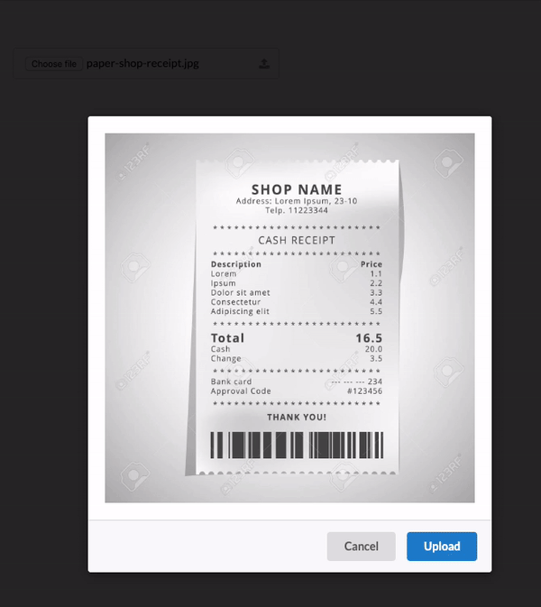

# Receipt Scanner
Upload and save image to Google Cloud Storage

# Geting Started

1. Replace sample config file with concrete values for projectId and bucket.
2. Add bucket using `gsutil mb gs://[YOUR-BUCKET-NAME]`
3. Set Bucket to be readable `gsutil defacl set public-read gs://[YOUR-BUCKET-NAME]`
4. Use default authentication using `gcloud beta auth application-default login`
5. `npm install`
6. `npm start`
